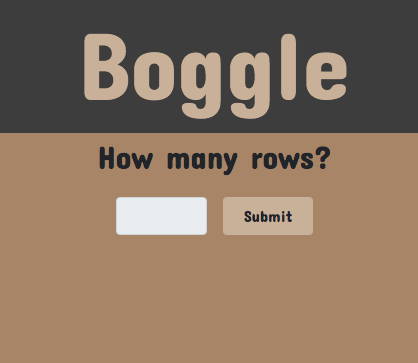
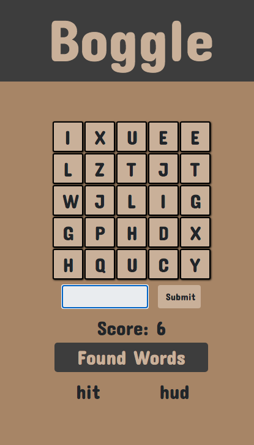
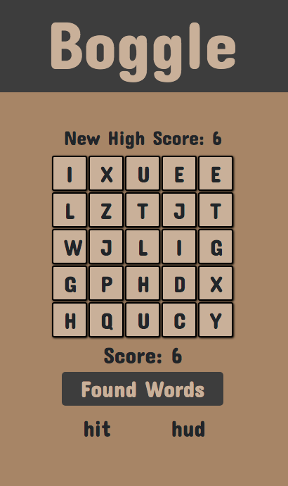

# Boggle

A boggle game using python completed for an assignment at Springboard.

Start by picking how many rows you want the board to be.  

  

Once submitted the game will load and a 60 second timer will start.  Try and find as many words as you can within the board.  Found words will show below and submissions that are not words or repeated words will flash errors.  

  

At the end of the game if your score will be checked against the current high-score and shown above the board.  This high-score is stored in the session.  

## Built Using  

Flask - framework
Python - Back-end and game logic
Bootstrap - styling
JavaScript - DOM manipulation and UI

